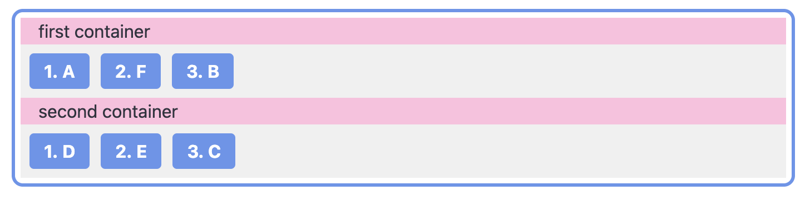

# Streamlit Sortables

Streamlit Sortables is a component for Streamlit applications that allows users to create sortable lists. This component enhances the interactivity of your Streamlit apps by enabling users to sort lists of strings in the UI.

https://user-images.githubusercontent.com/329750/163662202-ce292fc4-2882-46ac-8c2c-ca4b9df675d2.mp4

## Features

- **Sortable Lists**: Easily sort lists of strings or dictionaries.
- **Multiple Containers**: Support for sorting items across multiple containers.
- **Custom Styling**: Apply custom CSS styles to match your application's theme.

## Installation

Install the package via pip:

```bash
pip install streamlit-sortables
```

## Usage

### Sorting a List of Strings

Use the `sort_items` method to sort a list of strings. The return value is the sorted list.

```python
import streamlit as st
from streamlit_sortables import sort_items

original_items = ['A', 'B', 'C']
sorted_items = sort_items(original_items)

st.write(f'Original items: {original_items}')
st.write(f'Sorted items: {sorted_items}')
```

### Sorting with Multiple Containers

You can pass a list of dictionaries with `multi_containers=True` to sort items across multiple containers.

```python
import streamlit as st
from streamlit_sortables import sort_items

original_items = [
    {'header': 'First Container',  'items': ['A', 'B', 'C']},
    {'header': 'Second Container', 'items': ['D', 'E', 'F']}
]

sorted_items = sort_items(original_items, multi_containers=True)

st.write(f'Original items: {original_items}')
st.write(f'Sorted items: {sorted_items}')
```

### Theme Customization

Here's a simple example of how to customize the theme by changing the background color and font size, and numbering the items. By default, styles are defined in [SortableComponent.css](streamlit_sortables/frontend/src/SortableComponent.css):

```python
import streamlit as st
from streamlit_sortables import sort_items

original_items = [
    {'header': 'Container', 'items': ['Item 1', 'Item 2', 'Item 3']}
]

simple_style = """
.sortable-component {
    background-color:rgb(0, 225, 255);
    font-size: 16px;
    counter-reset: item;
}
.sortable-item {
    background-color: black;
    color: white;
}
"""

sorted_items = sort_items(original_items, multi_containers=True, custom_style=simple_style)

st.write(f'Original items: {original_items}')
st.write(f'Sorted items: {sorted_items}')
```

This example changes the background color to a light blue, sets the font size to 16px, and numbers the items.

### Advanced CSS Customization

This example demonstrates advanced CSS customization, including theme customization and item numbering. Apply custom CSS styles using the `custom_style` option.

```python
import streamlit as st
from streamlit_sortables import sort_items

original_items = [
    {'header': 'First Container',  'items': ['A', 'B', 'C']},
    {'header': 'Second Container', 'items': ['D', 'E', 'F']}
]

custom_style = """
.sortable-component {
    border: 3px solid #6495ED;
    border-radius: 10px;
    padding: 5px;
}
.sortable-container {
    background-color: #F0F0F0;
    counter-reset: item;
}
.sortable-container-header {
    background-color: #FFBFDF;
    padding-left: 1rem;
}
.sortable-container-body {
    background-color: #F0F0F0;
}
.sortable-item, .sortable-item:hover {
    background-color: #6495ED;
    font-color: #FFFFFF;
    font-weight: bold;
}
.sortable-item::before {
    content: counter(item) ". ";
    counter-increment: item;
}
"""
sorted_items = sort_items(original_items, multi_containers=True, custom_style=custom_style)

st.write(f'Original items: {original_items}')
st.write(f'Sorted items: {sorted_items}')
```



## Contributing

Contributions are welcome! Please submit issues or pull requests for any bugs or feature requests.

## License

This project is licensed under the Apache License 2.0. See the [LICENSE](LICENSE) file for details.
